---
title:
- Java Placement Cource (DSA) notes
author:
- Chaitanya Shahare
numbersections: true
header-includes: |
  \usepackage{float}
  \let\origfigure\figure
  \let\endorigfigure\endfigure
  \renewenvironment{figure}[1][2] {
    \expandafter\origfigure\expandafter[H]
    } {
    \endorigfigure
    }
---

\maketitle
\tableofcontents

\newpage

> [ Lecture 1](https://youtu.be/yRpLlJmRo2w)

> 22.12.2022
> Thursday

# Introduction to Java Language

## Set of Instructions

- Flowchart
- Psudocode

## Flowchart

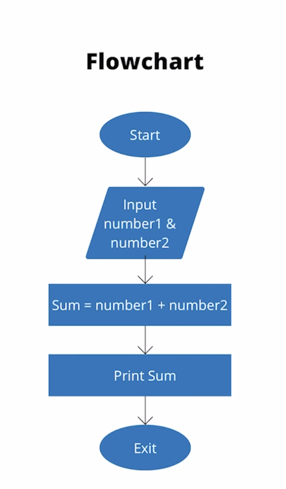{ width=250px }

## Psudocode

1. Start
1. Input 2 number
1. Calculate Sum = number1 + number2
1. Print Sum
1. Exit

## Java Class 1

### Installation

1. Java Development Kit (JDK)
1. Code Editor / IDE
  - VS Code
  - Intellij
  - Eclipse

### First Code

- Extension -> .java

#### Hello World

```java
class FirstClass {
  public static void main(String args[]) {
    System.out.println("Hello World");
  }
}
```

### How is code running?

{width=300px}

1. Compilation

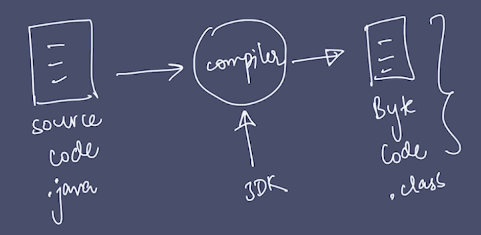{width=300px}

2. Execution

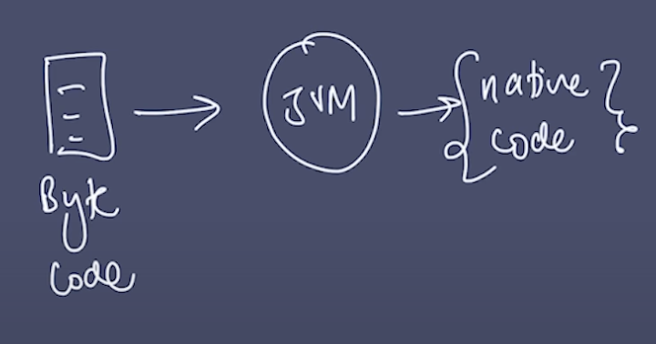{width=300px}

### Code Components

#### Function

```java
void main(){

}
```

#### Class

```java
class Main{
  void main() {

  }
}
```

\newpage

> [ Lecture 2](https://www.youtube.com/watch?v=LusTv0RlnSU&list=PLfqMhTWNBTe3LtFWcvwpqTkUSlB32kJop&index=3)

> 22.12.2022
> Thursday

# Variables in Java

## Output

```java
System.out.print("Hello World");
```

`Hello world` is the string which is printed.

- Use double quotes for strings

### Boilerplate code

```java
package com.apnacollege;

public class Main{
  public static void main(String[] args) {
    // Output
    System.out.print("Hello World");
  }
}
```

Here:

- System -> class
- print -> function

```java
System.out.println("Hello world with java");
```

- print -> for output on the same line
  ```
  System.out.print("Hello World");
  ```
- println -> for output on the next line
  ```
  System.out.println("Hello world with java");
  ```
- "\\n" ->
  ```
  System.out.print("Hello World\n");
  ```

### Q. Print the pattern

{ width=150px }

```java
public class Main{
  public static void main(String[] args) {
    // Output
    System.out.println("*");
    System.out.println("**");
    System.out.println("***");
    System.out.println("****");
  }
}
```

## Variables

`Perimeter = 2 * (a + b)`

here,

- 2 -> constant
- a&b -> variable

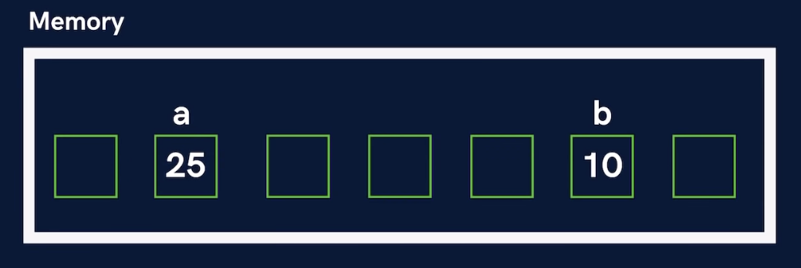{width=400px}

```java
public class Main{
  public static void main(String[] args) {
    // Variables
    String name = "tony stark";
    int age = 48;
    double price = 23.25;
    int a = 25;
    int b = 1;

    b = 20;
    name = "ironman";
  }
}
```

## Data Type

Java is a typed language.
i.e; you need to tell the datatype.

### Types of Datatypes

- Primitive
- Non-Primitive

Primitive               Non-Primitive
-----------------  --------------------
byte               String
short              Array
char               Class
boolean            Object
int                Interface
long
float
double

---

### Data Type sizes

Primitive               Size (in bytes)
-----------------  --------------------
byte               1
short
char               2
boolean            1
int                4
long               8
float              4
double             8


_Above sizes are for a 64-bit System_

---

```java
public class Main {
  public static void main(String[] argss) {
    // Variables
    int a = 10;
    int b = 25;

    int sum = a + b;
    System.out.println(sum);

    int diff = b - a;
    System.out.println(diff);

    int mul = a * b;
    System.out.println(mul);

  }
}
```

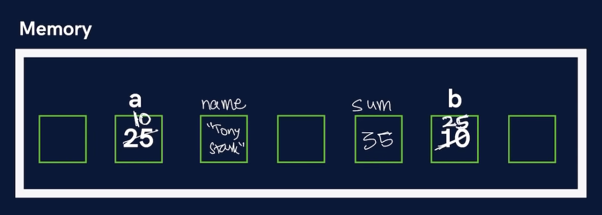{width=400}

## Inputs in Java

```java
import java.util.*;

public class Main {
  public static void main(String[] args) {
    // Input
    Scanner sc = new Scanner(System.in);
    String name = sc.next(); // next() -> for next token ie; next word
    String name1 = sc.nextLine(); // nextLine() -> for taking a sentence as Input
    // Similarly
    // nextInt()
    // nextFloat()
    System.out.println(name);
  }
}

```

## Q. Take 2 variables 'a' & 'b' and print their sum.

```java
import java.util.*;

public class Main {
  public static void main(String[] args) {
    Scanner sc = new Scanner(System.in);
    int a = sc.nextInt();
    int b = sc.nextInt();
    int sum = a + b;
    System.out.println(sum);
  }
}
```

\newpage

> [Lecture 3](https://youtu.be/I5srDu75h_M)

> 23.12.2022
> Friday

# Conditional Statements

> Topics covered
- if, else
- else if
- switch
- break

## if, else

### Syntax

```java
if (condition){

}
else {

}
```

---

Example

### Q. Write a program to identify if a person is an adult.

```java
import java.util.*;

public class Conditions {
  public static void main(String args[]) {
    Scanner sc = new Scanner(System.in);
    int age = sc.nextInt();

    if (age > 18) {
      System.out.println("Adult");
    } else {
      System.out.println("Not Adult");
    }
  }
}
```

### Q. Write a program to check if a number is odd or even.

```java
import java.util.*;

public class Conditions {
  public static void main(String args[]) {
    Scanner sc = new Scanner(System.in);
    int x = sc.nextInt();

    if (x % 2 == 0) {
      System.out.println("Even");
    } else {
      System.out.println("Odd");
    }
  }
}
```

## else if

### Q. Write a program to know if a is greater of lesser than b.

```java
import java.util.*;

public class Conditions {
  public static void main(String args[]) {
    Scanner sc = new Scanner(System.in);
    int a = sc.nextInt();
    int b = sc.nextInt();

    if (a == b) {
      System.out.println("Equal");
    }
    else if (a > b) {
      System.out.println("a is greater than b");
    }
    else {
      System.out.println("a is lesser than b")
    }
  }
}
```

## Switch

### Syntax

```java
switch (variable) {
case 1:
  break;
case 2:
  break;
default:

}
```

### Q. Using switch write a program to greet in different languages

```java
import java.util.*;

public class Conditions {
  public static void main(String args[]) {
    Scanner sc = new Scanner(System.in);
    int button = sc.nextInt();

    switch(button) {
      case 1: System.out.println("hello");
      break;
      case 2: System.out.println("namaste");
      break;
      case 3: System.out.println("bonjour");
      break;
      dafault: System.out.println("Invalid Button");
    }
  }
}

```

### Q. Make a calculator

Make a Calculator. Take 2 numbers (a & b) from the user and an operation as follows :

- : + (Addition) a + b
- : - (Subtraction) a - b
- : * (Multiplication) a * b
- : / (Division) a / b
- : % (Modulo or remainder) a % b

Calculate the result according to the operation given and display it to the user.

```java

```

### Q. Ask the user to enter the number of the month & print the name of the month.
For eg - For ‘1’ print ‘January’, ‘2’ print ‘February’ & so on.

```java

```

\newpage

> Lecture 4

> 23.12.2022
> Friday

# Loops

> Topics covered
- for Loop
- while Loop
- do while Loop

## For Loop

### Syntax

```java
for (initialisation; condition; updation) {
  // do something
}
```

- initialisation -> int counter = 0
- condition -> counter < 100
- updation -> counter = counter + 2

Example

```java
public class Loops {
  public static void main(String args[]) {
    for (int counter = 0; counter < 100; counter += 1){
      System.out.println("Hello world")
    }
  }
}
```

> Note: if any condition is not given
> an infinite loop will run

### Q. Print the number from 0 to 10 using for loop

```java
public class Loops {
  public static void main(String args[]) {
    // counter++ => counter = counter + 1
    for ( int i = 0; i < 11; i ++ ) [
      System.out.println(i);
    ]
  }
}
```

> **Dry Run** => When analysing code without actually coding

## While Loop

### Syntax

```java
int i = 0; // initialisation

while(condition){ // condition
  // do something
  i++; //updation
}
```
### Q. Print the number from 0 to 10 using while loop

```java
public class Loops {
  public static void main(String args[]) {
    int i = 0;
    while(i<11){
      System.out.println(i);
      i++;
    }
  }
}
```

## Do While Loop

### Syntax

```java
int i = 0; // initialisation

do {
  // do something
  i++; // updation
}while(condition) // condition
```

> In do while loop, the loop is run at least once.

### Q. Print the number from 0 to 10 using do while loop

```java
public class Loops {
  public static void main(String args[]) {
    int i = 0;
    do {
      System.out.println(i);
      i++;
    } while(i<11);
  }
}
```

---

## Questions

### Q. Print the sum of first `n` natural numbers.

```java
import java.util.*;

public class Loops {
  public static void main(String args[]){
    Scanner sc = new Scanner(System.in);
    int n = sc.nextInt();

    int sum = 0;
    for(int i=0; i<=n; i++) {
      sum = sum + i;
    }

    System.out.println(sum);
  }
}
```

### Q. Print the table if a number input by the user.

```java
import java.util.*;

public class Loops {
  public static void main(String args[]) {
    Scanner sc = new Scanner(System.in);
    int n = sc.nextInt();

    for(int i=1; i<11; i++) {
      System.out.println(i*n);
    }

  }
}
```

### Q. Print all even numbers till n.

```java

```

### Q. Make a menu driven program. The user can enter 2 numbers, either 1 or 0.

If the user enters 1 then keep taking input from the user for a student’s marks(out of 100).
If they enter 0 then stop.
If he/ she scores :
Marks >=90 -> print “This is Good”
89 >= Marks >= 60 -> print “This is also Good”
59 >= Marks >= 0 -> print “This is Good as well”
  Because marks don’t matter but our effort does.
(Hint : use do-while loop but think & understand why)

```java

```

---

\newpage

> [Lecture 5](https://youtu.be/GjHNGM7KN3w)

> 25.12.2022
> Sunday

# Basic Pattern Questions

## Nested Loops

```java
for(..){
  for(..){

  }
}
```

## Q. Print the solid rectangle pattern

{ width=150px }

```java
import java.util.*;

class Patterns {
  public static void main(String args[]) {
    int n = 4;
    int m = 5;

    // inner loop
    for(int i=1; i<=n; i++) {
      // inner loop
      for (int j = 1; j <= m; j++) {
        System.out.print("*");
      }
      System.out.println();
    }
  }
}
```

## Q. Print the hollow rectangle pattern

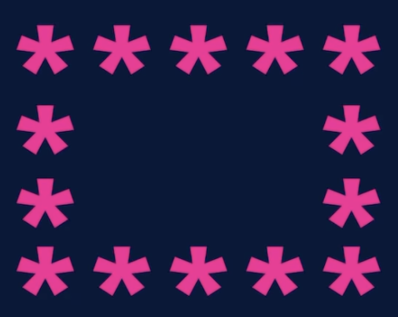{ width=150px }

```java
import java.util.*;

public class patterns_hollow_rectangle {
  public static void main(String[] args) {
    int n = 4;
    int m = 5;

    // Outer loop
    for (int i = 1; i <= n; i++) {
      // Inner loop
      for (int j = 1; j <= m; j++) {
        // cell -> (i,j)
        if (i == 1 || j == 1 || i == n || j == m) {
          System.out.print("*");
        } else {
          System.out.print(" ");
        }

      }
      System.out.println();
    }
  }
}
```

## Q. Print the half pyramid pattern

{ width=150px }

```java
import java.util.*;

public class patterns_half_pyramid {
  public static void main(String[] args) {
    int n = 4;

    // Outer loop
    for ( int i = 1; i <= n; i++) {
      // Inner Loop
      for (int j = 1; j <= i; j++ ) {
        System.out.print("*");
      }
      System.out.println();
    }
  }
}
```

## Q. Print the inverted half pyramid pattern

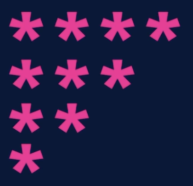{ width=150px }

```java
import java.util.*;

public class patterns_half_pyramid {
  public static void main(String[] args) {
    int n = 4;

    // Outer loop
    for ( int i = n; i >= 1; i--) {
      // Inner Loop
      for (int j = 1; j <= i; j++ ) {
        System.out.print("*");
      }
      System.out.println();
    }
  }
}
```

## Q. Print the inverted half pyramid pattern (rotated by 180 deg)

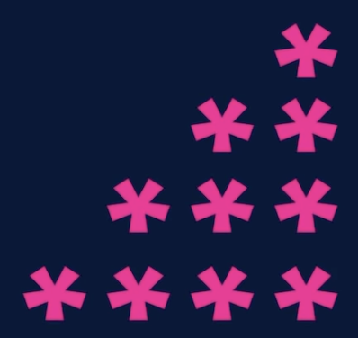{ width=150px }

```java
import java.util.*;

public class patterns_inverted_half_pyramid_180 {
  public static void main(String[] args) {
    int n = 4;

    // Outer loop
    for (int i = 1; i <= n; i++) {
      // Inner loop
      for (int j = 1; j <= n; j++) {
        if ( j > n - i )
          System.out.print("*");
        else
          System.out.print(" ");
      }
      System.out.println();
    }
  }
}
```

## Q. Print the half pyramid with numbers pattern

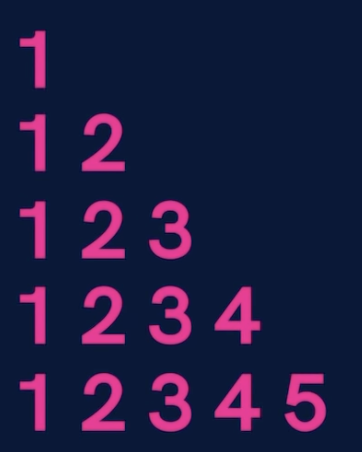{ width=150px }

```java
import java.util.*;

public class patterns_half_pyramid_numbers {
  public static void main(String[] args) {
    int n = 5;

    // Outer loop
    for (int i = 1; i <= n; i++) {
      // Inner loop
      for (int j = 1; j <= i; j++) {
        System.out.print(j);
      }
      System.out.println();
    }
  }
}
```

## Q. Print the Inverted half pyramid with numbers pattern

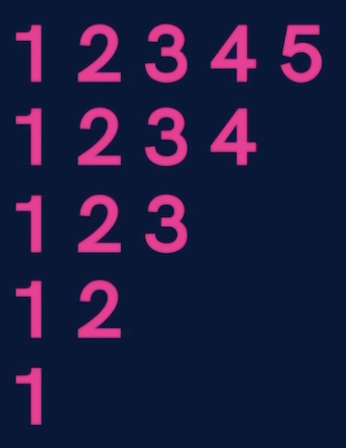{ width=150px }

```java
import java.util.*;

public class patterns_inverted_half_pyramid_numbers {
  public static void main(String[] args) {
    int n = 5;

    // Outer loop
    for (int i = 1; i <= n; i++) {
      // Inner loop
      for(int j = 1; j <= n-i+1; j++) {
        System.out.print(j);
      }
      System.out.println();
    }
  }
}
```

## Q. Print the Floyd's triangle pattern

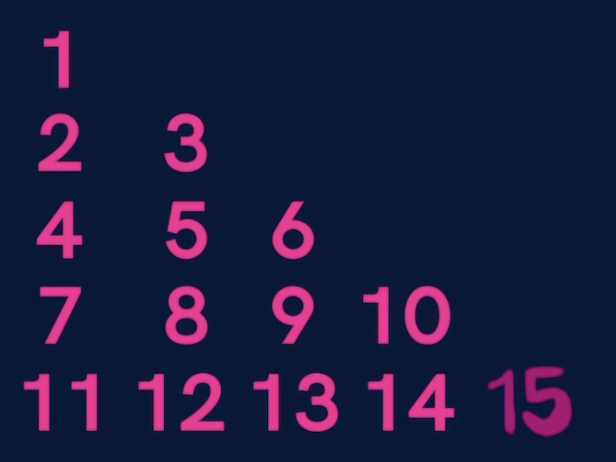{ width=150px }

```java
import java.util.*;

public class patterns_floyds_triangle {
  public static void main(String[] args) {
    int n = 5;
    int a = 1;

    // Outer loop
    for (int i = 1; i <= n; i++) {
      // Inner loop
      for (int j = 1; j <= i; j++) {
        System.out.print(a);
        a++;
      }
      System.out.println();
    }
  }
}
```

## Q. Print the 0-1 triangle pattern

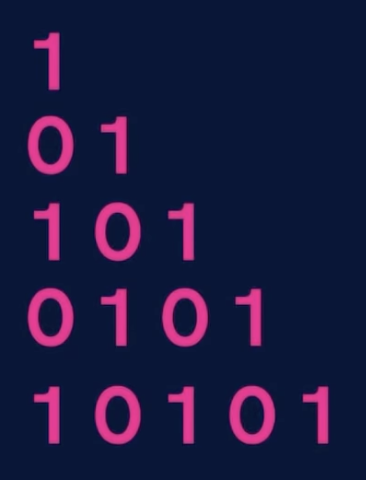{ width=150px }

```java
import java.util.*;

class Patterns {
  public static void main(String[] args) {
    int n = 5;
    int a = 1;

    // Outer loop
    for (int i = 1; i <= n; i++) {
      // Inner loop
      for (int j = 1; j <= i; j++) {
        int sum = i+j;
        if (sum % 2 == 0) { //even
          System.out.print("1 ");
        } else { // odd
          System.out.print("0 ");
        }
      }
      System.out.println();
    }
  }
}
```

---

\newpage

> [Lecture 6](https://youtu.be/Dr4PpNa7AYo)

> 25.12.2022
> Sunday

# Advanced Pattern Questions

## Q. Print the butterfly Patterns

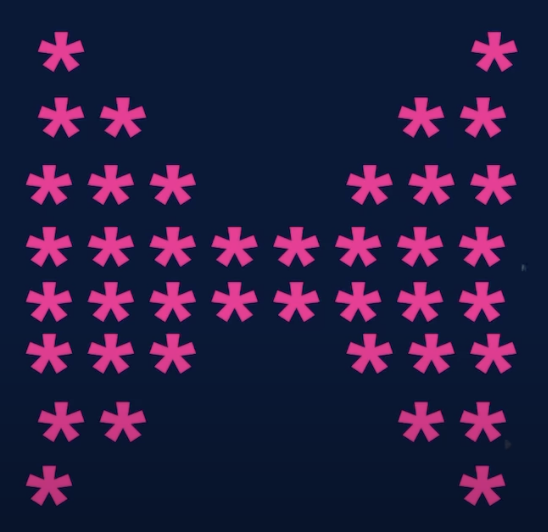{ width=170px }

```java
import java.util.*;

public class patterns_butterfly {
  public static void main(String[] args) {
    int n = 4;

       //upper part
       for(int i=1; i<=n; i++) {
           for(int j=1; j<=i; j++) {
               System.out.print("*");
           }

           int spaces = 2 * (n-i);
           for(int j=1; j<=spaces; j++) {
               System.out.print(" ");
           }

           for(int j=1; j<=i; j++) {
               System.out.print("*");
           }
           System.out.println();
       }

            //lower part
       for(int i=n; i>=1; i--) {
           for(int j=1; j<=i; j++) {
               System.out.print("*");
           }

           int spaces = 2 * (n-i);
           for(int j=1; j<=spaces; j++) {
               System.out.print(" ");
           }

           for(int j=1; j<=i; j++) {
               System.out.print("*");
           }
           System.out.println();
       }
  }
}
```

## Q. Print the solid rhombus Patterns

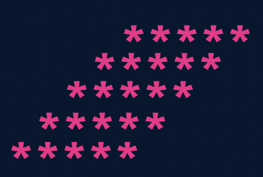{ width=200px }

```java
import java.util.*;

public class patterns_solid_rhombus {
  public static void main(String[] args) {
    int n = 5;

    for ( int i = 1; i <= n ; i++) {
      // spaces
      for (int j = 1; j <= n-i; j++) {
        System.out.print(" ");
      }

      // stars
      for (int j = 1; j <= 5; j++) {
        System.out.print("*");
      }
      System.out.println();
    }
  }
}
```

## Q. Print the number pyramid pattern

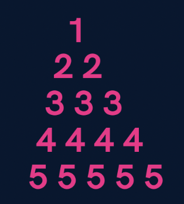{ width=150px }

```java
import java.util.*;

public class patterns_number_pyramid {
  public static void main(String[] args) {
    int n = 5;

    // Outer loop
    for (int i = 1; i <= n; i++) {
      // spaces
      for (int j = 1; j <= n-i; j++) {
        System.out.print(" ");
      }
      // numbers => print row no., row no. times
      for (int j = 1; j <= i; j++) {
        System.out.print(i + " ");
      }
      System.out.println();
    }
  }
}
```

## Q. Print a palindrome number pyramid pattern

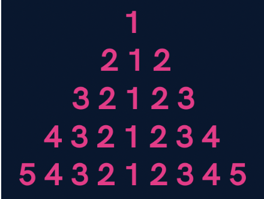{width=175px}

```java
import java.util.*;

public class patterns_palindrome_pyramid {
  public static void main(String[] args) {
    int n = 5;

    for (int i = 1; i <= n; i++) {
      // spaces
      for (int j = 1; j <= n-i; j++) {
        System.out.print(" ");
      }

      // 1st half numbers
      for (int j = i; j >= 1; j--) {
        System.out.print(j);
      }

      // 2nd half numbers
      for (int j = 2; j <= i; j++) {
        System.out.print(j);
      }
      System.out.println();
    }
  }
}
```

## Q. Print the diamond pattern

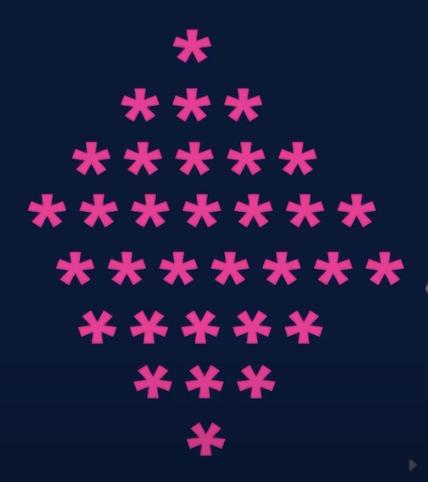{ width=150px }

```java
import java.util.*;

public class patterns_diamond {
  public static void main(String[] args) {
    int n = 4;

    // upper half
    for (int i = 1; i <= n; i++) {
      // spaces
      for (int j = 1; j <= n-i; j++) {
        System.out.print(" ");
      }

      // stars
      for (int j = 1; j <= 2*i-1; j++) {
        System.out.print("*");
      }
      System.out.println();
    }
    // lower half
    for (int i = n; i >= 1; i--) {
      // spaces
      for (int j = 1; j <= n-i; j++) {
        System.out.print(" ");
      }

      // stars
      for (int j = 1; j <= 2*i-1; j++) {
        System.out.print("*");
      }
      System.out.println();
    }
  }
}
```

## Print a hollow butterfly

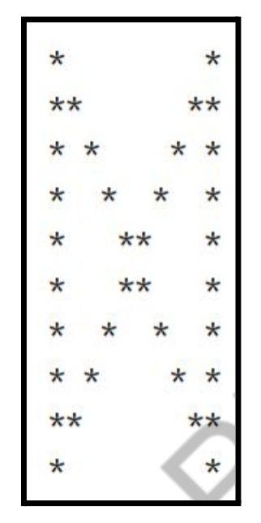{ width=125px }

```java
```

## Print a hollow rhomubus

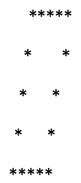{ width=100px }

```java
```

## Print Pascal's triangle

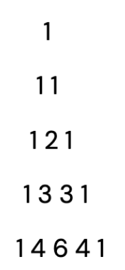{ width=100px }

```java
```

## Print Inverted half pyramid pattern

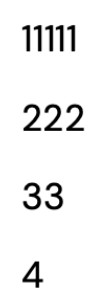{ width=100px }

```java
```

%% ldakfjlkjsafd
