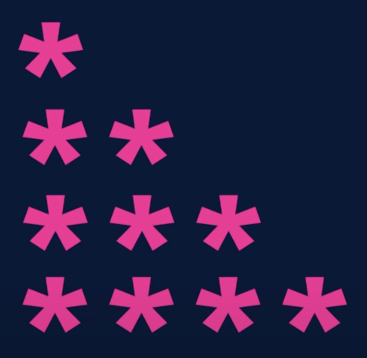
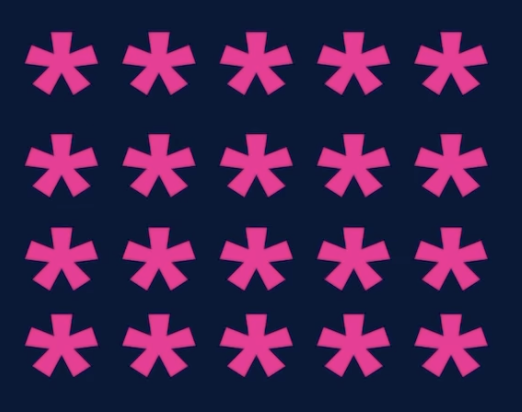
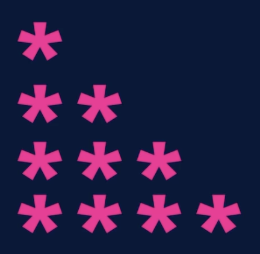
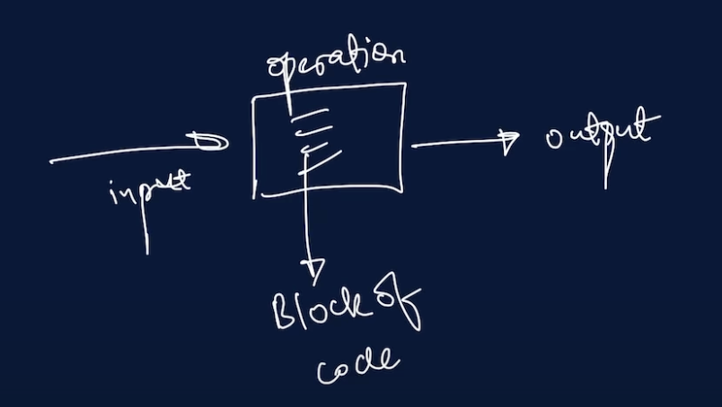
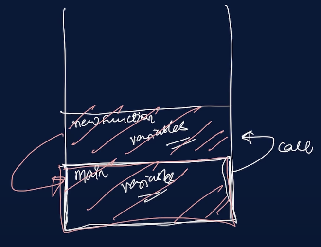
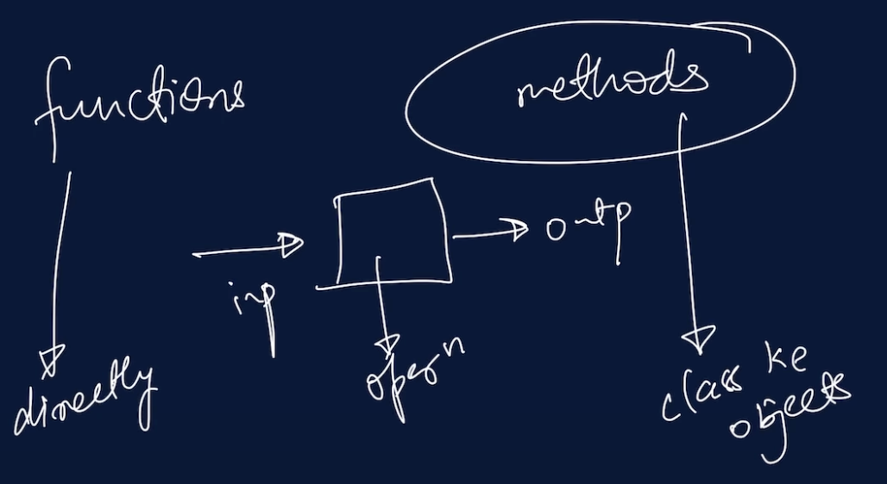
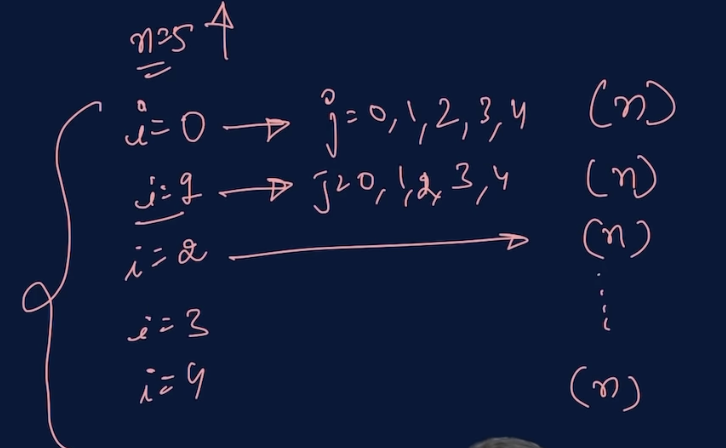
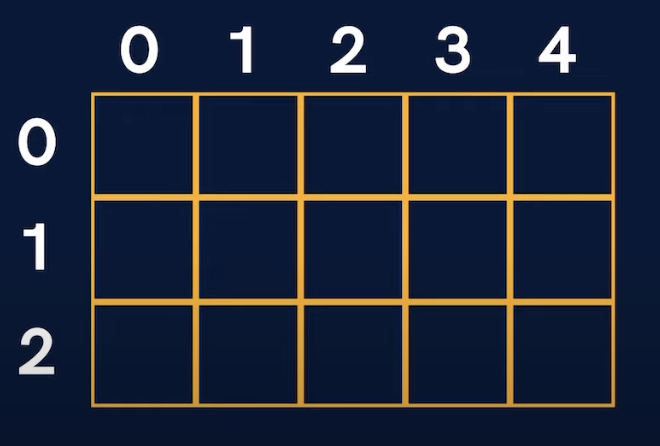
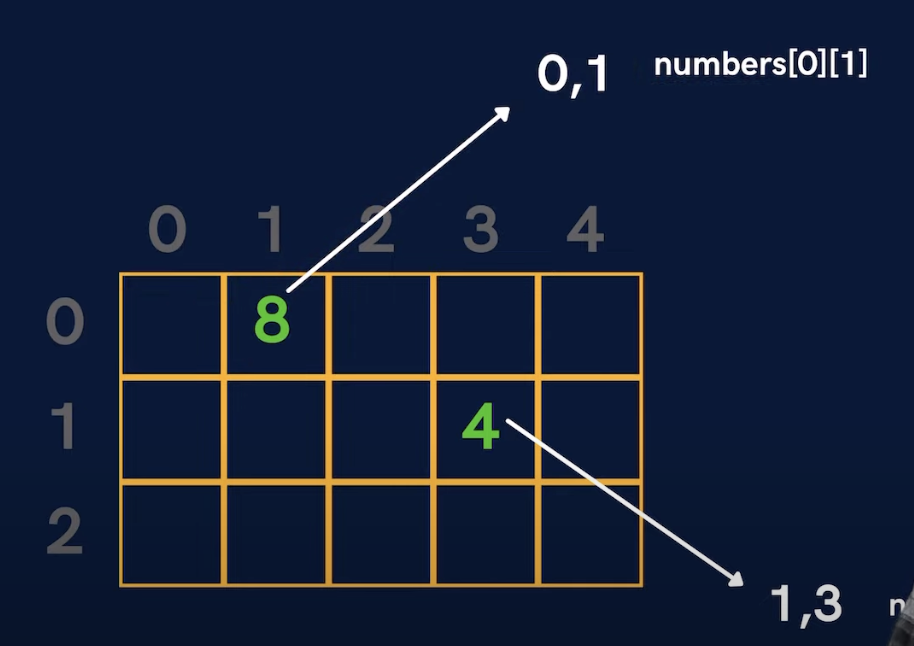

---
title:
- Java Placement Cource (DSA) notes
author:
- Chaitanya Shahare
numbersections: true
header-includes: |
  \usepackage{float}
  \let\origfigure\figure
  \let\endorigfigure\endfigure
  \renewenvironment{figure}[1][2] {
    \expandafter\origfigure\expandafter[H]
    } {
    \endorigfigure
    }
---

\maketitle
\tableofcontents

\newpage

> [ Lecture 1](https://youtu.be/yRpLlJmRo2w)

> 22.12.2022
> Thursday

# Introduction to Java Language

## Set of Instructions

- Flowchart
- Psudocode

## Flowchart

{ width=250px }

## Psudocode

1. Start
1. Input 2 number
1. Calculate Sum = number1 + number2
1. Print Sum
1. Exit

## Java Class 1

### Installation

1. Java Development Kit (JDK)
1. Code Editor / IDE
  - VS Code
  - Intellij
  - Eclipse

### First Code

- Extension -> .java

#### Hello World

```java
class FirstClass {
  public static void main(String args[]) {
    System.out.println("Hello World");
  }
}
```

### How is code running?

{width=300px}

1. Compilation

{width=300px}

2. Execution

{width=300px}

### Code Components

#### Function

```java
void main(){

}
```

#### Class

```java
class Main{
  void main() {

  }
}
```

\newpage

> [ Lecture 2](https://www.youtube.com/watch?v=LusTv0RlnSU&list=PLfqMhTWNBTe3LtFWcvwpqTkUSlB32kJop&index=3)

> 22.12.2022
> Thursday

# Variables in Java

## Output

```java
System.out.print("Hello World");
```

`Hello world` is the string which is printed.

- Use double quotes for strings

### Boilerplate code

```java
package com.apnacollege;

public class Main{
  public static void main(String[] args) {
    // Output
    System.out.print("Hello World");
  }
}
```

Here:

- System -> class
- print -> function

```java
System.out.println("Hello world with java");
```

- print -> for output on the same line
  ```
  System.out.print("Hello World");
  ```
- println -> for output on the next line
  ```
  System.out.println("Hello world with java");
  ```
- "\\n" ->
  ```
  System.out.print("Hello World\n");
  ```

### Q. Print the pattern

{ width=150px }

```java
public class Main{
  public static void main(String[] args) {
    // Output
    System.out.println("*");
    System.out.println("**");
    System.out.println("***");
    System.out.println("****");
  }
}
```

## Variables

`Perimeter = 2 * (a + b)`

here,

- 2 -> constant
- a&b -> variable

{width=400px}

```java
public class Main{
  public static void main(String[] args) {
    // Variables
    String name = "tony stark";
    int age = 48;
    double price = 23.25;
    int a = 25;
    int b = 1;

    b = 20;
    name = "ironman";
  }
}
```

## Data Type

Java is a typed language.
i.e; you need to tell the datatype.

### Types of Datatypes

- Primitive
- Non-Primitive

Primitive               Non-Primitive
-----------------  --------------------
byte               String
short              Array
char               Class
boolean            Object
int                Interface
long
float
double

---

### Data Type sizes

Primitive               Size (in bytes)
-----------------  --------------------
byte               1
short
char               2
boolean            1
int                4
long               8
float              4
double             8


_Above sizes are for a 64-bit System_

---

```java
public class Main {
  public static void main(String[] argss) {
    // Variables
    int a = 10;
    int b = 25;

    int sum = a + b;
    System.out.println(sum);

    int diff = b - a;
    System.out.println(diff);

    int mul = a * b;
    System.out.println(mul);

  }
}
```

{width=400}

## Inputs in Java

```java
import java.util.*;

public class Main {
  public static void main(String[] args) {
    // Input
    Scanner sc = new Scanner(System.in);
    String name = sc.next(); // next() -> for next token ie; next word
    String name1 = sc.nextLine(); // nextLine() -> for taking a sentence as Input
    // Similarly
    // nextInt()
    // nextFloat()
    System.out.println(name);
  }
}

```

## Q. Take 2 variables 'a' & 'b' and print their sum.

```java
import java.util.*;

public class Main {
  public static void main(String[] args) {
    Scanner sc = new Scanner(System.in);
    int a = sc.nextInt();
    int b = sc.nextInt();
    int sum = a + b;
    System.out.println(sum);
  }
}
```

\newpage

> [Lecture 3](https://youtu.be/I5srDu75h_M)

> 23.12.2022
> Friday

# Conditional Statements

> Topics covered
- if, else
- else if
- switch
- break

## if, else

### Syntax

```java
if (condition){

}
else {

}
```

---

Example

### Q. Write a program to identify if a person is an adult.

```java
import java.util.*;

public class Conditions {
  public static void main(String args[]) {
    Scanner sc = new Scanner(System.in);
    int age = sc.nextInt();

    if (age > 18) {
      System.out.println("Adult");
    } else {
      System.out.println("Not Adult");
    }
  }
}
```

### Q. Write a program to check if a number is odd or even.

```java
import java.util.*;

public class Conditions {
  public static void main(String args[]) {
    Scanner sc = new Scanner(System.in);
    int x = sc.nextInt();

    if (x % 2 == 0) {
      System.out.println("Even");
    } else {
      System.out.println("Odd");
    }
  }
}
```

## else if

### Q. Write a program to know if a is greater of lesser than b.

```java
import java.util.*;

public class Conditions {
  public static void main(String args[]) {
    Scanner sc = new Scanner(System.in);
    int a = sc.nextInt();
    int b = sc.nextInt();

    if (a == b) {
      System.out.println("Equal");
    }
    else if (a > b) {
      System.out.println("a is greater than b");
    }
    else {
      System.out.println("a is lesser than b")
    }
  }
}
```

## Switch

### Syntax

```java
switch (variable) {
case 1:
  break;
case 2:
  break;
default:

}
```

### Q. Using switch write a program to greet in different languages

```java
import java.util.*;

public class Conditions {
  public static void main(String args[]) {
    Scanner sc = new Scanner(System.in);
    int button = sc.nextInt();

    switch(button) {
      case 1: System.out.println("hello");
      break;
      case 2: System.out.println("namaste");
      break;
      case 3: System.out.println("bonjour");
      break;
      dafault: System.out.println("Invalid Button");
    }
  }
}

```

### Q. Make a calculator

Make a Calculator. Take 2 numbers (a & b) from the user and an operation as follows :

- : + (Addition) a + b
- : - (Subtraction) a - b
- : * (Multiplication) a * b
- : / (Division) a / b
- : % (Modulo or remainder) a % b

Calculate the result according to the operation given and display it to the user.

```java

```

### Q. Ask the user to enter the number of the month & print the name of the month.
For eg - For ‘1’ print ‘January’, ‘2’ print ‘February’ & so on.

```java

```

\newpage

> Lecture 4

> 23.12.2022
> Friday

# Loops

> Topics covered
- for Loop
- while Loop
- do while Loop

## For Loop

### Syntax

```java
for (initialisation; condition; updation) {
  // do something
}
```

- initialisation -> int counter = 0
- condition -> counter < 100
- updation -> counter = counter + 2

Example

```java
public class Loops {
  public static void main(String args[]) {
    for (int counter = 0; counter < 100; counter += 1){
      System.out.println("Hello world")
    }
  }
}
```

> Note: if any condition is not given
> an infinite loop will run

### Q. Print the number from 0 to 10 using for loop

```java
public class Loops {
  public static void main(String args[]) {
    // counter++ => counter = counter + 1
    for ( int i = 0; i < 11; i ++ ) [
      System.out.println(i);
    ]
  }
}
```

> **Dry Run** => When analysing code without actually coding

## While Loop

### Syntax

```java
int i = 0; // initialisation

while(condition){ // condition
  // do something
  i++; //updation
}
```
### Q. Print the number from 0 to 10 using while loop

```java
public class Loops {
  public static void main(String args[]) {
    int i = 0;
    while(i<11){
      System.out.println(i);
      i++;
    }
  }
}
```

## Do While Loop

### Syntax

```java
int i = 0; // initialisation

do {
  // do something
  i++; // updation
}while(condition) // condition
```

> In do while loop, the loop is run at least once.

### Q. Print the number from 0 to 10 using do while loop

```java
public class Loops {
  public static void main(String args[]) {
    int i = 0;
    do {
      System.out.println(i);
      i++;
    } while(i<11);
  }
}
```

---

## Questions

### Q. Print the sum of first `n` natural numbers.

```java
import java.util.*;

public class Loops {
  public static void main(String args[]){
    Scanner sc = new Scanner(System.in);
    int n = sc.nextInt();

    int sum = 0;
    for(int i=0; i<=n; i++) {
      sum = sum + i;
    }

    System.out.println(sum);
  }
}
```

### Q. Print the table if a number input by the user.

```java
import java.util.*;

public class Loops {
  public static void main(String args[]) {
    Scanner sc = new Scanner(System.in);
    int n = sc.nextInt();

    for(int i=1; i<11; i++) {
      System.out.println(i*n);
    }

  }
}
```

### Q. Print all even numbers till n.

```java

```

### Q. Make a menu driven program. The user can enter 2 numbers, either 1 or 0.

If the user enters 1 then keep taking input from the user for a student’s marks(out of 100).
If they enter 0 then stop.
If he/ she scores :
Marks >=90 -> print “This is Good”
89 >= Marks >= 60 -> print “This is also Good”
59 >= Marks >= 0 -> print “This is Good as well”
  Because marks don’t matter but our effort does.
(Hint : use do-while loop but think & understand why)

```java

```

---

\newpage

> [Lecture 5](https://youtu.be/GjHNGM7KN3w)

> 25.12.2022
> Sunday

# Basic Pattern Questions

## Nested Loops

```java
for(..){
  for(..){

  }
}
```

## Q. Print the solid rectangle pattern

{ width=150px }

```java
import java.util.*;

class Patterns {
  public static void main(String args[]) {
    int n = 4;
    int m = 5;

    // inner loop
    for(int i=1; i<=n; i++) {
      // inner loop
      for (int j = 1; j <= m; j++) {
        System.out.print("*");
      }
      System.out.println();
    }
  }
}
```

## Q. Print the hollow rectangle pattern

{ width=150px }

```java
import java.util.*;

public class patterns_hollow_rectangle {
  public static void main(String[] args) {
    int n = 4;
    int m = 5;

    // Outer loop
    for (int i = 1; i <= n; i++) {
      // Inner loop
      for (int j = 1; j <= m; j++) {
        // cell -> (i,j)
        if (i == 1 || j == 1 || i == n || j == m) {
          System.out.print("*");
        } else {
          System.out.print(" ");
        }

      }
      System.out.println();
    }
  }
}
```

## Q. Print the half pyramid pattern

{ width=150px }

```java
import java.util.*;

public class patterns_half_pyramid {
  public static void main(String[] args) {
    int n = 4;

    // Outer loop
    for ( int i = 1; i <= n; i++) {
      // Inner Loop
      for (int j = 1; j <= i; j++ ) {
        System.out.print("*");
      }
      System.out.println();
    }
  }
}
```

## Q. Print the inverted half pyramid pattern

{ width=150px }

```java
import java.util.*;

public class patterns_half_pyramid {
  public static void main(String[] args) {
    int n = 4;

    // Outer loop
    for ( int i = n; i >= 1; i--) {
      // Inner Loop
      for (int j = 1; j <= i; j++ ) {
        System.out.print("*");
      }
      System.out.println();
    }
  }
}
```

## Q. Print the inverted half pyramid pattern (rotated by 180 deg)

{ width=150px }

```java
import java.util.*;

public class patterns_inverted_half_pyramid_180 {
  public static void main(String[] args) {
    int n = 4;

    // Outer loop
    for (int i = 1; i <= n; i++) {
      // Inner loop
      for (int j = 1; j <= n; j++) {
        if ( j > n - i )
          System.out.print("*");
        else
          System.out.print(" ");
      }
      System.out.println();
    }
  }
}
```

## Q. Print the half pyramid with numbers pattern

{ width=150px }

```java
import java.util.*;

public class patterns_half_pyramid_numbers {
  public static void main(String[] args) {
    int n = 5;

    // Outer loop
    for (int i = 1; i <= n; i++) {
      // Inner loop
      for (int j = 1; j <= i; j++) {
        System.out.print(j);
      }
      System.out.println();
    }
  }
}
```

## Q. Print the Inverted half pyramid with numbers pattern

{ width=150px }

```java
import java.util.*;

public class patterns_inverted_half_pyramid_numbers {
  public static void main(String[] args) {
    int n = 5;

    // Outer loop
    for (int i = 1; i <= n; i++) {
      // Inner loop
      for(int j = 1; j <= n-i+1; j++) {
        System.out.print(j);
      }
      System.out.println();
    }
  }
}
```

## Q. Print the Floyd's triangle pattern

{ width=150px }

```java
import java.util.*;

public class patterns_floyds_triangle {
  public static void main(String[] args) {
    int n = 5;
    int a = 1;

    // Outer loop
    for (int i = 1; i <= n; i++) {
      // Inner loop
      for (int j = 1; j <= i; j++) {
        System.out.print(a);
        a++;
      }
      System.out.println();
    }
  }
}
```

## Q. Print the 0-1 triangle pattern

{ width=150px }

```java
import java.util.*;

class Patterns {
  public static void main(String[] args) {
    int n = 5;
    int a = 1;

    // Outer loop
    for (int i = 1; i <= n; i++) {
      // Inner loop
      for (int j = 1; j <= i; j++) {
        int sum = i+j;
        if (sum % 2 == 0) { //even
          System.out.print("1 ");
        } else { // odd
          System.out.print("0 ");
        }
      }
      System.out.println();
    }
  }
}
```

---

\newpage

> [Lecture 6](https://youtu.be/Dr4PpNa7AYo)

> 25.12.2022
> Sunday

# Advanced Pattern Questions

## Q. Print the butterfly Patterns

{ width=170px }

```java
import java.util.*;

public class patterns_butterfly {
  public static void main(String[] args) {
    int n = 4;

       //upper part
       for(int i=1; i<=n; i++) {
           for(int j=1; j<=i; j++) {
               System.out.print("*");
           }

           int spaces = 2 * (n-i);
           for(int j=1; j<=spaces; j++) {
               System.out.print(" ");
           }

           for(int j=1; j<=i; j++) {
               System.out.print("*");
           }
           System.out.println();
       }

            //lower part
       for(int i=n; i>=1; i--) {
           for(int j=1; j<=i; j++) {
               System.out.print("*");
           }

           int spaces = 2 * (n-i);
           for(int j=1; j<=spaces; j++) {
               System.out.print(" ");
           }

           for(int j=1; j<=i; j++) {
               System.out.print("*");
           }
           System.out.println();
       }
  }
}
```

## Q. Print the solid rhombus Patterns

{ width=200px }

```java
import java.util.*;

public class patterns_solid_rhombus {
  public static void main(String[] args) {
    int n = 5;

    for ( int i = 1; i <= n ; i++) {
      // spaces
      for (int j = 1; j <= n-i; j++) {
        System.out.print(" ");
      }

      // stars
      for (int j = 1; j <= 5; j++) {
        System.out.print("*");
      }
      System.out.println();
    }
  }
}
```

## Q. Print the number pyramid pattern

{ width=150px }

```java
import java.util.*;

public class patterns_number_pyramid {
  public static void main(String[] args) {
    int n = 5;

    // Outer loop
    for (int i = 1; i <= n; i++) {
      // spaces
      for (int j = 1; j <= n-i; j++) {
        System.out.print(" ");
      }
      // numbers => print row no., row no. times
      for (int j = 1; j <= i; j++) {
        System.out.print(i + " ");
      }
      System.out.println();
    }
  }
}
```

## Q. Print a palindrome number pyramid pattern

{width=175px}

```java
import java.util.*;

public class patterns_palindrome_pyramid {
  public static void main(String[] args) {
    int n = 5;

    for (int i = 1; i <= n; i++) {
      // spaces
      for (int j = 1; j <= n-i; j++) {
        System.out.print(" ");
      }

      // 1st half numbers
      for (int j = i; j >= 1; j--) {
        System.out.print(j);
      }

      // 2nd half numbers
      for (int j = 2; j <= i; j++) {
        System.out.print(j);
      }
      System.out.println();
    }
  }
}
```

## Q. Print the diamond pattern

{ width=150px }

```java
import java.util.*;

public class patterns_diamond {
  public static void main(String[] args) {
    int n = 4;

    // upper half
    for (int i = 1; i <= n; i++) {
      // spaces
      for (int j = 1; j <= n-i; j++) {
        System.out.print(" ");
      }

      // stars
      for (int j = 1; j <= 2*i-1; j++) {
        System.out.print("*");
      }
      System.out.println();
    }
    // lower half
    for (int i = n; i >= 1; i--) {
      // spaces
      for (int j = 1; j <= n-i; j++) {
        System.out.print(" ");
      }

      // stars
      for (int j = 1; j <= 2*i-1; j++) {
        System.out.print("*");
      }
      System.out.println();
    }
  }
}
```

## Print a hollow butterfly

{ width=125px }

```java
```

## Print a hollow rhomubus

{ width=100px }

```java
```

## Print Pascal's triangle

{ width=100px }

```java
```

## Print Inverted half pyramid pattern

{ width=100px }

```java
```

---

\newpage

> [Lecture 7](https://youtu.be/qcSz4ef9UHA)

> 27.12.2022
> Tuesday

# Functions & Methods

Functions is a block of code with takes input, 
performs some operations
and returns output.

{ width=300px  }

## Syntax

```java
returnType functionName(type arg1, type arg2 ..){
  // operations
}
```

- returnType -> int, float, String, ...
  - returnType void -> no return
- public static -> oops, for now prefix of every function
- type -> int, float, String, ...

## Q. Print a given name in a function

```java
import java.util.*;

public class Functions {
  public static void printMyName(String name) {
    System.out.println(name);
    return;
  }
  public static void main(String[] args) {
    Scanner sc = new Scanner(System.in);  
    String name = sc.next();

    printMyName(name); // function is invoked
  }
}
```

## What happens in memory?

- All functions are saved in memory in stack form.
  - a single unit in a stack is a **stack frame**.

- function no. $\uparrow$ , stack size $\uparrow$

{ width=250px }

- When main function is running is is created in the memory
- When it invokes some other function that function is created in the memory and saved as a stack
- When the invoked function is executed it is removed from the memory
- And after the completion of the main function it is also removed
- Variables in a particular function are stored in the same stack frame as the function

More about memory in the OOPs Chapter

## Q. Make a function to add 2 numbers and return the sum

```java
public static void calculateSum(int a, int b) {
  int sum = a + b;
  return sum;
}
```

## Q. Make a function to multiply 2 numbers and return the product

```java
public static int calculateProduct(int a, int b) {
    return a * b;
}
```

## Q. Find a factorial of a number

```java
public static void printFactorial(int n) {
  if(n<0){
    System.out.println("Invalid Number");
    return;
  }

  int factorial = 1;

  // loop
  for(int i = n; i >= 1; i--){
    factorial = factorial * i;
  }
}
```

## Difference between funcions & methods

{ width=300px }

- we call functions directly
- and methods through objects of class

---

\newpage

> [Lecture 8](https://youtu.be/pFPZ83mgH00)

> 27.12.2022
> Tuesday

# Functions practice questions

> [Link to the pdf document](https://docs.google.com/document/d/1eEv8JMCr_ZBoE5JSsZxdT5Zq53vq388-EIbE_mi7QME/edit)

## Enter 3 numbers from the user & make a function to print their average.

## Write a function to print the sum of all odd numbers from 1 to n.

## Write a function which takes in 2 numbers and returns the greater of those two.

## Write a function that takes in the radius as input and returns the circumference of a circle.

## Write a function that takes in age as input and returns if that person is eligible to vote or not. A person of age > 18 is eligible to vote.

## Write an infinite loop using do while condition.

## Write a program to enter the numbers till the user wants and at the end it should display the count of positive, negative and zeros entered. 

## Two numbers are entered by the user, x and n. Write a function to find the value of one number raised to the power of another i.e. xn.

## Write a function that calculates the Greatest Common Divisor of 2 numbers. (BONUS)

## Write a program to print Fibonacci series of n terms where n is input by user:

0 1 1 2 3 5 8 13 21 ..... 
In the Fibonacci series, a number is the sum of the previous 2 numbers that came before it. (BONUS)

---

\newpage

> [Lecture 9](https://youtu.be/bQssdSrSGNE)

> 27.12.2022
> Tuesday

# Basics of Time & Space Complexity

## Time Complexity

> **Relation** between **Input Size** & **Running Time** (operations).

### Example

```java
public static void main(String args[]){
  Scanner sc = new Scanner(System.in);
  int n = sc.nextInt();

  for(int i = 0; i < n; i++) {
    System.out.println("hello");
  }
}
```

- input n -> time n
- time complexity $\alpha$ input n
- Linear relation

### Types of time complexity

1. Best case -> $\Omega()$
1. Average case -> $\theta()$
1. Worst case -> $O()$ `bigO`

- We always assume worst case time complexity _i.e;_ $0()$

### Example

```java
public static void main(String args[]) {
  Scanner sc = new Scanner(System.in);
  int n = sc.nextInt();

  for(int i = 0 ; i < n ; i++) {
    for(int j = 0; j < n; j++) {
    System.out.println("hello");
    }
  }
}
```
{ width=300px }

$$n\times n = n^2$$

worst case time complexity -> $O(n^2)$

### Comparing Time Complexities

Compare  $O(n)$  $O(n^2)$  $O(n^3)$
-------- ------- --------- ---------
n=1       1       1         12
n=2       2       4         8
n=3       3       9         27
n=$10^5$ $10^5$  $10^{10}$   $10^{30}$
          Best    2ndBest   Worst

## Space Complexity

> Space complexity depends on the space the program occupies in the memory.

- input int n -> space complexity constant
- Array -> space complexity depends on input

---

\newpage

> [Lecture 10](https://youtu.be/NTHVTY6w2Co)

> 29.12.2022
> Thursday

# Introduction to Arrays

- List of same datatype variables.
- zero-indexed

## Syntax

```java
type[] arrayName = new type[size];
```

*or*

```java
type arrayName[] = {1,2,3,4,5,6};
```

e.g;

```java
int[] marks = new int[20];
```

### for storing

```java
marks[0] = 92;
marks[1] = 88;
```

## Q. Take an array as input from the user.

Search for a given number x and print the index at which it occurs.

```java
import java.util.*;
 
public class Arrays {
   public static void main(String args[]) {
       Scanner sc = new Scanner(System.in);
       int size = sc.nextInt();
       int numbers[] = new int[size];
 
       for(int i=0; i<size; i++) {
           numbers[i] = sc.nextInt();
       }
 
       //print the numbers in array
       for(int i=0; i<arr.length; i++) {
           System.out.print(numbers[i]+" ");
       }
   }
}
```

- algorigtm -> **Linear Search**

## Q. Take an array of names as input from the user and print them on the screen

## Q. Find the maximum & minimum number in an array of integers

[HINT : Read about Integer.MIN_VALUE & Integer.MAX_VALUE in Java]

## Q. Take an array of numbers as input and check if it is an array sorted in ascending order

Eg : { 1, 2, 4, 7 } is sorted in ascending order.
       {3, 4, 6, 2} is not sorted in ascending order.

---

\newpage

> [Lecture 11](https://youtu.be/18Zt5I4S45o)

> 29.12.2022
> Thursday

# 2-D Arrays

{ width=200px }

rows = 3 ; columns = 5

*Total memory consumption of a 2d array = ( rows x cols ) x datatype-size*

## Syntax 

```java
type[][] arrayName = new type[rows][columns];
```

eg. 

```java
int[][] numbers = new int[3][5];
```

{ width=300px }

## Q. Take a matrix as input from the user

Search for a given number x and print the indices at which it occurs

```java
public class TwoDArrays {
   public static void main(String args[]) {
       Scanner sc = new Scanner(System.in);
       int rows = sc.nextInt();
       int cols = sc.nextInt();
 
       int[][] numbers = new int[rows][cols];
 
       //input
       //rows
       for(int i=0; i<rows; i++) {
           //columns
           for(int j=0; j<cols; j++) {
               numbers[i][j] = sc.nextInt();
           }
       }
 
       int x = sc.nextInt();
 
       for(int i=0; i<rows; i++) {
           for(int j=0; j<cols; j++) {
               //compare with x
               if(numbers[i][j] == x) {
                   System.out.println("x found at location (" + i + ", " + j + ")");
               }
           }
       }
   }
}
```

> For more problems refer [this](https://docs.google.com/document/d/1XkI6549bd-qDvcUC88WuOW0ISPfrtm-Tk06pt_I-89I/edit)

---

\newpage

> [Lecture 12](https://youtu.be/vCRD36bG8xQ)

> 01.01.2023
> Sunday

# Strings

## String Declaration

```java
public class Strings {
	pubic static void main(String args[]) {
		// String Declaration
		String name = "Tony";
		String fullName = "Tony Stark";
		String sentence = "My name is Tony Stark";
	}
}
```

## String input

```java
public class Strings {
	pubic static void main(String args[]) {
		Scanner sc = new Scanner(System.in);
		String name = sc.nextLine();
		System.out.println("Your name is : " + name);
	}
}
```

- sc.next -> for word
- sc.nextLine -> for sentence

## String Functions

### Concatenation

**+**

```java
String fullName = firstName + " " + lastName
```

### Length

```java
.length()
```

### charAt()

```java
for(int i=0 ; i < fullName.length() ; i++) {
	System.out.println(fullName.charAt(i));
}
```

### Compare (.compareTo())

```java
name1.compareTo(name2);
```

- value of b is more than value of a; value of z is greater than l
- always use `.compareTo` when comparing strings instead of `==`

### Substring (.substring)

```java
String sentence = "My name is Tony";
String name = sentence.substring(11, sentence.length());
System.out.println(name);
```

## Strings are immutable

---

\newpage

> Lecture 13

> 01.01.223
> Sunday

# String Builder

String Builder is a class to make string processing faster

> Strings in Java are *Immutable*

## Declaration

```java
public class Strings {
	public static void main(String args[]) {
		StringBuilder sb = new StringBuilder("Tony");	
		System.out.println(sb);
	}	
}
```

## StringBuilder functions

### .charAt(index)

### .setCharAt(index, 'char')

```java
sb.setCharAt(0, "P");
```

### .insert(index, 'char')

```java
sb.insert(0, 'S');
```

### .delete(start, end)

```java
sb.delete(2,3);
```

### .append("char")

```java
sb.append("e")
```

### .length()

```java
sb.length()
```

## Q. Write a program to reverse a string

```java
public class StringBuilder {
	public static void main(String args[]){
		StringBuilder sb = new StringBuilder("hello");

		for(i = 0; i < sb.lenght()/2; i ++){
			int front = i ;
			int back = sb.lenght() - 1 - i;

			char frontChar = sb.charAt(front);
			char backChar = sb.charAt(back);

			sb.setCharAt(front, backChar);
			sb.setCharAt(back, frontChar);
		}
	}
}
```

- time complextity of the above code is $O(n)$
